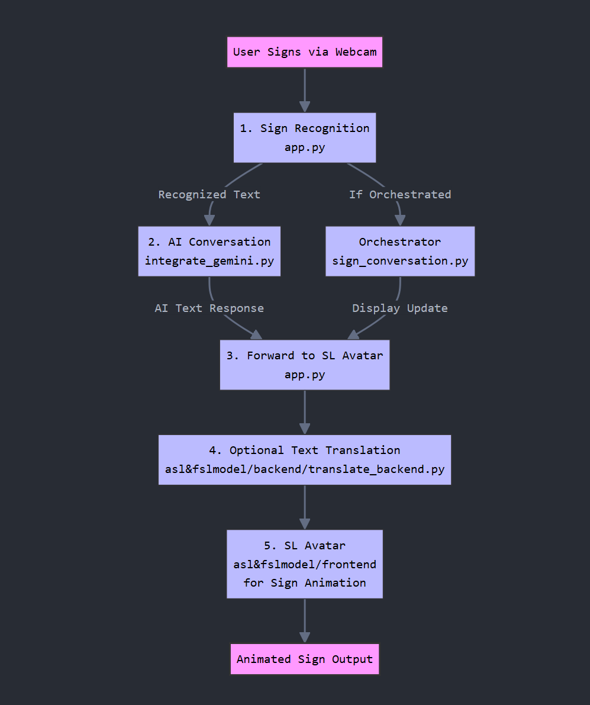

# 🧠 Dynamic Sign Language Translator with AI & Avatar Animation

A multi-service AI-powered app that **translates sign language into text**, generates a conversational AI response using **Google Gemini**, and then **animates the response** into sign language gestures through a digital avatar.

> 👋 **Sign** ➡️ 📝 **Text** ➡️ 🤖 **AI Response** ➡️ 🤟 **Animated Sign Language**

---

## 📦 Project Structure

| Component                                   | Description                                                                 | Port   |
| ------------------------------------------- | --------------------------------------------------------------------------- | ------ |
| `app.py`                                    | Flask app for live webcam sign recognition using MediaPipe + TensorFlow.    | `5000` |
| `integrate_gemini.py`                       | Gemini API interface via Flask for conversational AI generation.            | `5002` |
| `asl&fslmodel/backend/translate_backend.py` | Google Cloud Translation API wrapper for multilingual support.              | `5003` |
| `asl&fslmodel/frontend`                     | Angular frontend that animates AI responses into sign gestures.             | `4200` |
| `sign_conversation.py`                      | WebSocket-based orchestrator to integrate all backend and frontend modules. | `5001` |

---

## 🛠 Prerequisites

* **Python** `>=3.9`

* **Node.js** (LTS)

* **Angular CLI**

  ```bash
  npm install -g @angular/cli
  ```

* **Git**

* **Google Cloud Service Account**
  *(Required for translation and Gemini APIs)*

---

## 🚀 Setup Guide

### 1. Clone the Repository

```bash
git clone https://github.com/kavirtudez/ai-converse-feature
cd ai-converse-feature
```

### 2. Set Up Python Virtual Environment

```bash
python -m venv signenv

# Activate:
# On Windows:
signenv\Scripts\activate

# On macOS/Linux:
source signenv/bin/activate
```

### 3. Install Python Dependencies

```bash
pip install -r requirements.txt
```

### 4. Set Up Angular Frontend

```bash
cd asl&fslmodel/frontend
npm install
cd ../..
```

---

## 🔐 Google Cloud Configuration

### ✅ Translation API Setup

* Place your credentials JSON (e.g., `starlit-rite-452918-k8-ff712369ea61.json`) in the project root.
* Enable **Google Cloud Translation API** in your Google Cloud Console.
* The translation backend uses:

```python
os.environ["GOOGLE_APPLICATION_CREDENTIALS"] = "./starlit-rite-452918-k8-ff712369ea61.json"
```

### ✅ Gemini API Setup

* Enable the **Gemini API** (or **Vertex AI**) on Google Cloud.
* The API key is currently hardcoded in `integrate_gemini.py`. **For production**, move it to environment variables for security.

---

## 🧪 Running the App (Multi-Terminal Setup)

This project uses multiple microservices. Run each in **separate terminals** with the virtual environment activated.

---

### 🖐 Terminal 1 – Live Sign Recognition (`app.py`)

```bash
signenv\Scripts\activate  # or source signenv/bin/activate
python app.py
# Access: http://127.0.0.1:5000
```

### 🤖 Terminal 2 – Gemini API Integration (`integrate_gemini.py`)

```bash
signenv\Scripts\activate
python integrate_gemini.py
# Access: http://127.0.0.1:5002
```

### 🎨 Terminal 3 – Angular Frontend Animation (`ng serve`)

```bash
cd asl&fslmodel/frontend
ng serve
# Access: http://localhost:4200
```

### 🌍 Terminal 4 – Translation Backend (`translate_backend.py`)

```bash
signenv\Scripts\activate
cd asl&fslmodel/backend
python translate_backend.py
# Access: http://localhost:5003
```

### 🔁 Terminal 5 – System Orchestrator (`sign_conversation.py`)

```bash
signenv\Scripts\activate
python sign_conversation.py
# Access: http://127.0.0.1:5001/conversation
```

---

## 🌐 Accessing the Full System

Open your browser and go to:

```
http://127.0.0.1:5001/conversation
```

This orchestrated page embeds both the **sign input** interface and the **sign animation avatar** using iframes.

---

## 🧭 System Workflow (Detailed)

### 1. **Sign Language Recognition – `app.py`**

* Captures live webcam video.
* Uses **MediaPipe** to detect hand, face, and pose landmarks.
* Passes extracted landmarks to a **trained TensorFlow classifier**.
* Supports predefined signs (e.g., `hello`, `thank you`, `I love you`).

### 2. **Conversational AI – `integrate_gemini.py`**

* Receives the recognized text.
* Queries the **Google Gemini API**.
* Returns a context-aware, natural language response.

### 3. **Translation Layer (Optional) – `translate_backend.py`**

* Translates Gemini's English reply into **Tagalog** or other supported languages.
* Uses **Google Cloud Translation API**.

### 4. **Sign Animation Frontend – Angular**

* Converts the AI reply into animated sign gestures.
* Uses a **Text-to-Pose mapping** system.
* Avatar signs the response visually for deaf or hard-of-hearing users.

---

## 📊 Data Flow Overview

```plaintext
[ Webcam Capture ]
      ↓
[ app.py (Sign → Text) ]
      ↓
[ integrate_gemini.py (Text → AI Reply) ]
      ↓
[ translate_backend.py (Optional: Translate AI Reply) ]
      ↓
[ sign_conversation.py (WebSocket Router) ]
      ↓
[ Angular Frontend (AI Reply → Animated Signing Avatar) ]
```

---

## 🖼 Flow Diagram

```markdown

```

---

## ⚠️ Notes

* Ensure ports `5000`, `5001`, `5002`, `5003`, and `4200` are not used by other apps.
* Launch **backend services first**, then the frontend (`ng serve`).
* If your folder structure differs, update your `cd` paths accordingly.
* The system currently supports a **limited set of signs**. Expanding to full ASL/FSL is possible with a larger dataset and gesture model.

---

## 👥 Contributors

* **Tuazon**
* **Virtudez**
* **Lumikang**

